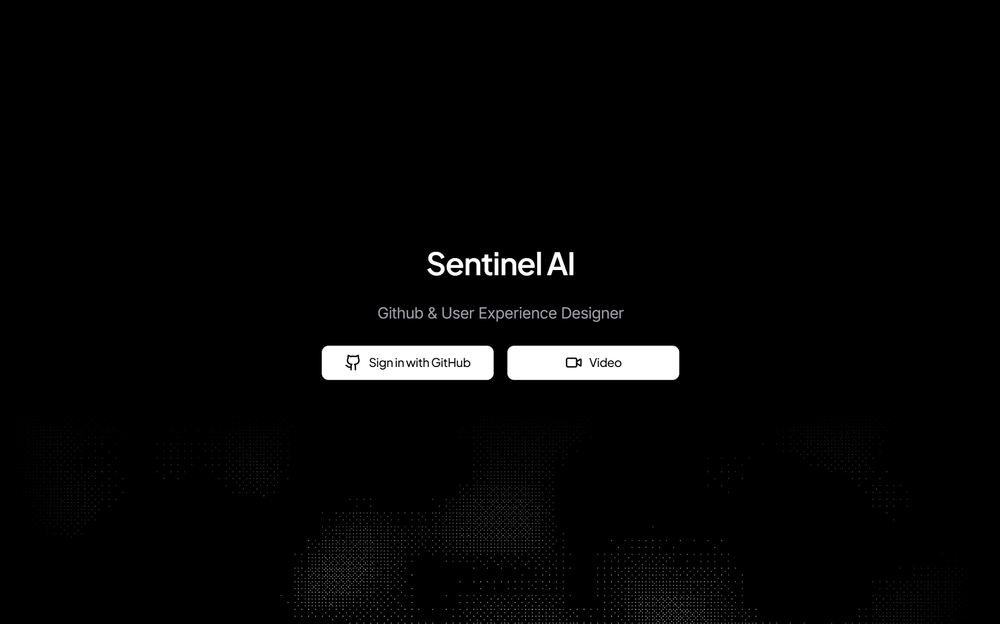

# Sentinel AI (IGRIS)



**Sentinel AI** is a powerful GitHub repository management and exploration web application with an integrated AI assistant powered by **Tambo AI**. Sign in with GitHub, browse your repositories, pull requests, and issues, and get intelligent AI help directly on top of your code and PRs.

> **What this is:** A Next.js application that acts as a smart GitHub dashboard plus an AI co-pilot for your repositories.

---

## Features

- **GitHub OAuth Authentication**
  - Secure sign-in with your GitHub account
  - Access to your public and (with proper scopes) private repositories

- **Repository Dashboard**
  - Paginated list of your repositories
  - Quick access to repo details, PRs, issues, and code
  - Customizable dashboard with themes, layouts, and visualizations
  - Repository statistics and contributor insights

- **Pull Request Management**
  - View open, merged, and closed pull requests
  - Inspect PR details, file changes, commits, and checks
  - Bulk actions: merge, close, or reopen multiple PRs
  - PR ready status tracking (checks + template alignment)
  - Review comments and conversations

- **Issues Management**
  - List and browse repository issues
  - Create new issues directly from the dashboard
  - View issue details with markdown rendering
  - Comment on issues and track conversations

- **Code Explorer**
  - Browse repository file trees
  - Quick navigation to files and directories
  - Integration with GitHub for full code browsing experience

- **AI Assistant (Tambo AI)**
  - Collapsible chat panel integrated into repository views
  - Ask questions about repos, PRs, issues, and code
  - AI-powered PR reviews and suggestions
  - Customizable dashboard through natural language
  - Keyboard shortcut: **Ctrl+I / Cmd+I** to toggle

- **Modern UI & Developer Experience**
  - Next.js App Router, TypeScript, Tailwind CSS
  - shadcn/ui components and Radix UI primitives
  - Dark/light theme with system preference support
  - Responsive design optimized for all devices
  - Optimized for GitHub content (avatars, markdown, etc.)

---

## Tech Stack

- **Framework**: [Next.js](https://nextjs.org/) (App Router)
- **Language**: [TypeScript](https://www.typescriptlang.org/)
- **UI / Styling**:
  - React + Tailwind CSS
  - [shadcn/ui](https://ui.shadcn.com/) and Radix UI primitives
  - Dark/light theme support
- **Authentication**: [NextAuth.js](https://next-auth.js.org/) (GitHub OAuth)
- **AI Integration**: [Tambo AI](https://tambo.ai/) (`@tambo-ai/react`, `@tambo-ai/typescript-sdk`)
- **Markdown Rendering**: `react-markdown`, `remark-gfm`, `github-markdown-css`
- **Charts & Visualizations**: Recharts
- **Tooling**: ESLint, Next.js build pipeline

---

## Getting Started

### Prerequisites

- **Node.js** v20+
- **Package manager**: npm, yarn, pnpm, or bun
- **GitHub OAuth App** (Client ID & Client Secret)
- **Tambo AI API key**

### Installation

Clone the repository and install dependencies:

```bash
git clone https://github.com/ihimanshu07/Tambo-IGRIS.git
cd Tambo-IGRIS

# choose one:
npm install
# or
yarn install
# or
pnpm install
```

### Environment Variables

Create a `.env.local` file in the project root:

```env
# GitHub OAuth
GITHUB_CLIENT_ID=your_github_client_id
GITHUB_CLIENT_SECRET=your_github_client_secret

# NextAuth
NEXTAUTH_URL=http://localhost:3000
# In production, set this to your real domain:
# NEXTAUTH_URL=https://your-domain.com

# Tambo AI
TAMBO_API_KEY=your_tambo_api_key
```

#### GitHub OAuth Setup

1. Go to **GitHub → Settings → Developer settings → OAuth Apps**
2. Create a new OAuth App
3. Set **Authorization callback URL** to:

   ```text
   http://localhost:3000/api/auth/callback/github
   ```

4. Copy the **Client ID** and **Client Secret** into `.env.local` as `GITHUB_CLIENT_ID` and `GITHUB_CLIENT_SECRET`

### Running in Development

```bash
npm run dev
# or
yarn dev
# or
pnpm dev
```

Then open [http://localhost:3000](http://localhost:3000) in your browser.

### Production Build

```bash
npm run build
npm run start
```

This runs the **optimized production build** on the default Next.js port (3000) unless configured otherwise.

---

## Usage

1. **Start the app** using the steps above
2. **Sign in with GitHub** when prompted
3. On the **dashboard**, select a repository to explore
4. Use the tabs/sections to:
   - View **pull requests** and details
   - Browse **issues**
   - Inspect the **code tree**
5. Open the **Tambo AI chat** panel (Ctrl+I / Cmd+I) to:
   - Ask questions about the repository
   - Get help understanding PRs or files
   - Receive suggestions or explanations about the codebase
   - Customize your dashboard through natural language

---

## Project Structure

High-level structure (simplified):

```text
Tambo-IGRIS/
├── app/                      # Next.js App Router
│   ├── api/                  # API routes (GitHub proxy, auth, repo data)
│   ├── dashboard/            # Main dashboard pages
│   │   ├── account/          # User account/profile page
│   │   ├── code/             # Code explorer
│   │   ├── examples/          # AI prompt examples
│   │   ├── issues/           # Issues list & details
│   │   └── pull-requests/    # Pull request pages
│   └── page.tsx              # Landing page
├── components/               # Shared UI components
│   ├── tambo/                # Tambo AI chat components
│   └── ui/                   # shadcn/ui wrappers
├── contexts/                 # React contexts
│   ├── repo-context.tsx      # Repository state management
│   └── dashboard-customization-context.tsx
├── lib/                      # Utilities and configuration
│   ├── tambo.ts              # Tambo AI configuration
│   └── utils.ts              # Helper functions
├── auth.ts                   # NextAuth configuration
├── middleware.ts              # Auth / route protection middleware
└── next.config.ts            # Next.js configuration
```

This may evolve over time; check the actual folders for the most up-to-date layout.

---

## Available Scripts

The following npm scripts are commonly used:

- `npm run dev` – Start the development server
- `npm run build` – Create an optimized production build
- `npm run start` – Start the production server (after `build`)
- `npm run lint` – Run ESLint checks

If you use yarn or pnpm, replace `npm run` with `yarn` / `pnpm` equivalents.

---

## Deployment

This is a standard Next.js app and can be deployed to platforms like **Vercel**, **Netlify**, or your own Node.js server.

### Vercel Deployment

1. Push the repository to GitHub
2. Create a new project in Vercel and import this repo
3. Configure the following environment variables in Vercel:
   - `GITHUB_CLIENT_ID`
   - `GITHUB_CLIENT_SECRET`
   - `NEXTAUTH_URL` (Vercel often sets `VERCEL_URL` automatically)
   - `TAMBO_API_KEY`
4. Deploy – Vercel will run `npm install`, `npm run build`, and then host the app

Make sure your **GitHub OAuth callback URL** matches the production domain (e.g. `https://your-domain.com/api/auth/callback/github`).

---

## Important Links

- **GitHub Repository**: [https://github.com/ihimanshu07/Tambo-IGRIS](https://github.com/ihimanshu07/Tambo-IGRIS)
- **Tambo AI**: [https://tambo.ai/](https://tambo.ai/)
- **Next.js Documentation**: [https://nextjs.org/docs](https://nextjs.org/docs)
- **NextAuth.js Documentation**: [https://next-auth.js.org/](https://next-auth.js.org/)
- **shadcn/ui**: [https://ui.shadcn.com/](https://ui.shadcn.com/)
- **GitHub API Documentation**: [https://docs.github.com/en/rest](https://docs.github.com/en/rest)

---

## Contributing

Contributions, bug reports, and feature requests are welcome.

1. Fork the repository
2. Create a new branch: `git checkout -b feature/your-feature-name`
3. Make your changes and run `npm run lint`
4. Commit and push: `git push origin feature/your-feature-name`
5. Open a pull request with a clear description of your changes

